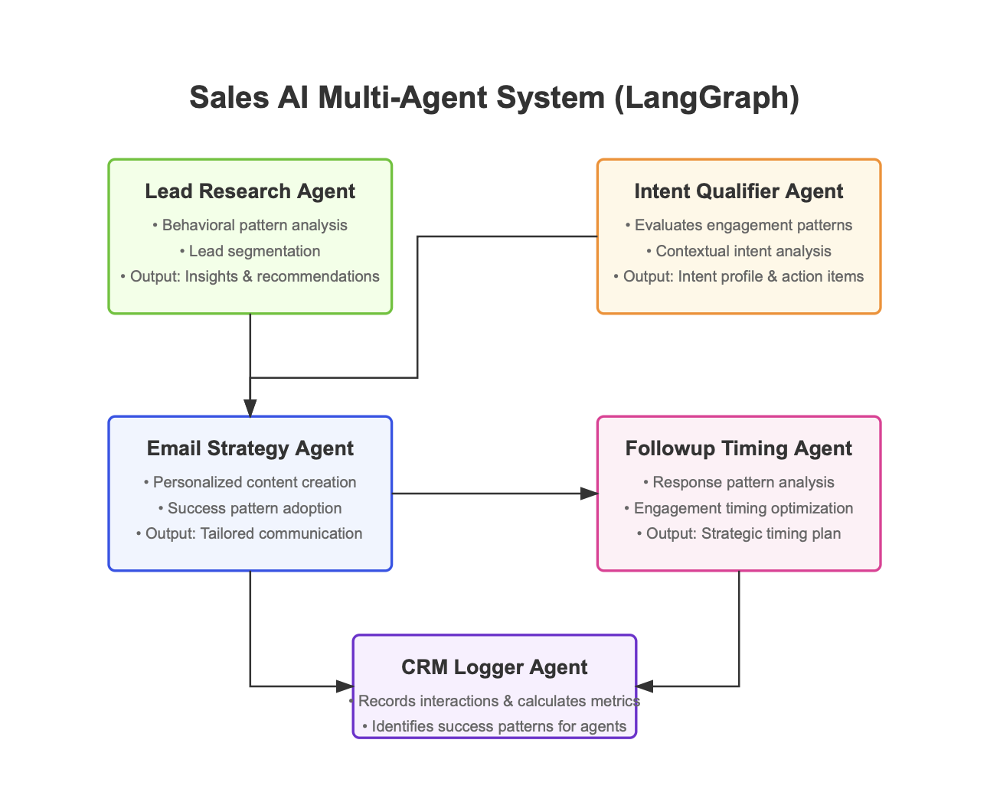
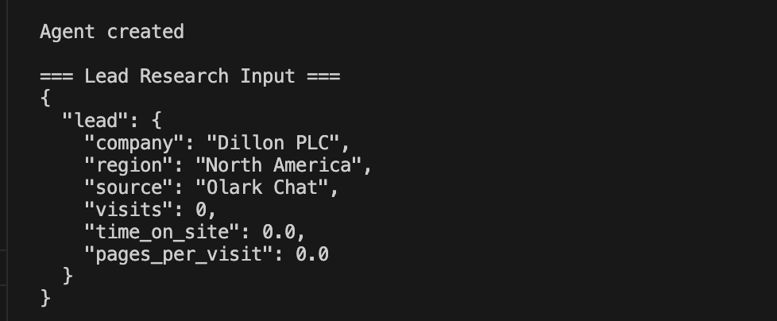
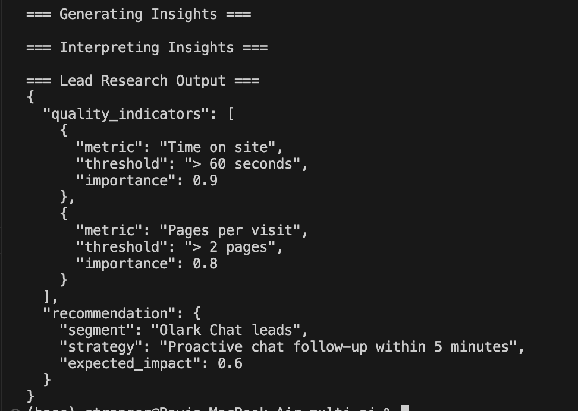
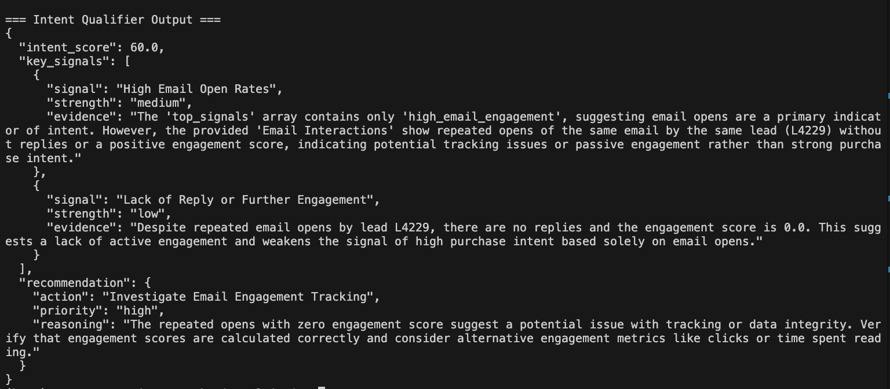
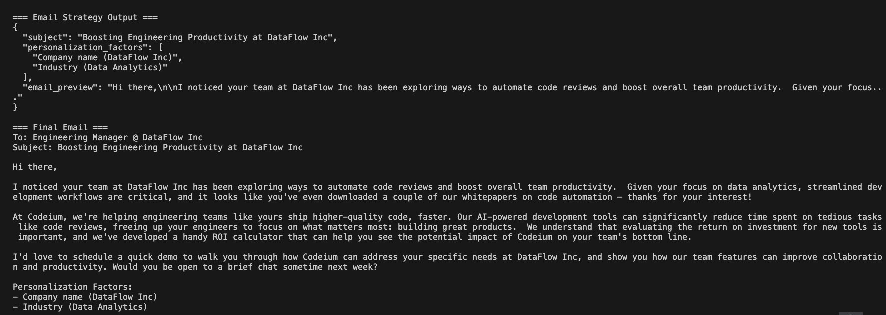
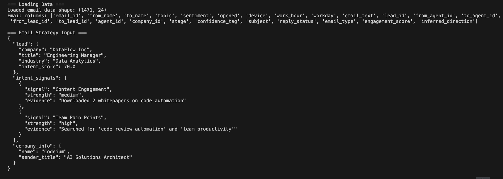
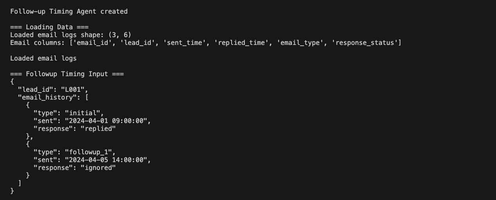
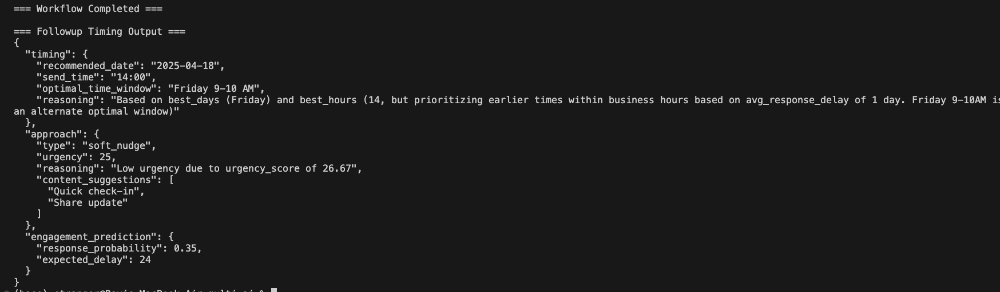
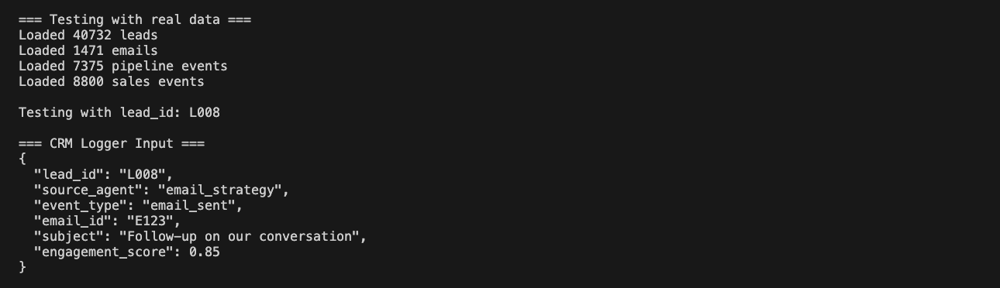
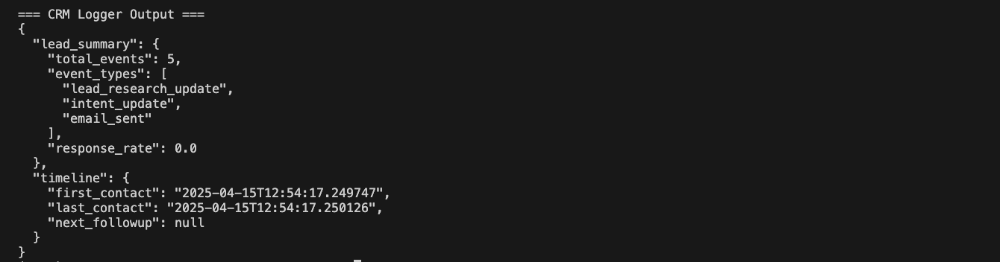

# 🧠 Multi-Agent AI for Sales Engagement (LangGraph + Gemini)

A modular, reasoning-first AI pipeline where five specialized agents collaborate to simulate an outbound sales team — from researching lead behavior to scoring intent, generating personalized emails, optimizing follow-up timing, and logging performance insights.

Powered by **LangGraph** for structured coordination and **Gemini LLM** for strategic reasoning, this system showcases how agent-based automation can scale intelligent sales outreach using real engagement data.

---

## 📌 Project Goal
> Demonstrate how a multi-agent architecture can drive contextual decision-making across the full sales funnel — not just generate responses, but analyze, personalize, and adapt based on lead behavior.

---

## 🧩 Agent Overview

| Agent | Purpose |
|-------|---------|
| 🕵️ Lead Research Agent | Analyzes behavioral patterns and segments leads |
| 🎯 Intent Qualifier Agent | Scores engagement and purchase readiness |
| 💌 Email Strategy Agent | Crafts tailored email content based on context |
| ⏰ Follow-Up Timing Agent | Suggests when and how to follow up |
| 📊 CRM Logger Agent | Logs lifecycle events and system insights |

---

## 🧠 System Architecture

<p align="center">
  
</p>

> Each agent plays a unique role in the pipeline and contributes feedback into a centralized CRM Logger, ensuring accountability and system-wide learning.

---

## 1️⃣ 🕵️ Lead Research Agent
### 🎯 Purpose
Identify behavior patterns and segment leads based on site activity and past conversion trends.

### ⚙️ Flow
```md
📦 Inputs: Leads CSV + Sales CSV

🔄 Flow:
1. `prepare_data()` → Clean & normalize
2. `analyze_patterns()` → Segment + score
3. `generate_insights()` → Recommend follow-up strategy
```

<table><tr>
<td></td>
<td></td>
</tr><tr>
<td align="center">🔹 Input: Olark Chat visitor (0 activity)</td>
<td align="center">✅ Output: Recommend chat follow-up (impact: 0.6)</td>
</tr></table>

---

## 2️⃣ 🎯 Intent Qualifier Agent
### 🎯 Purpose
Analyze engagement signals (email behavior, site visits) to score lead readiness.

### ⚙️ Flow
```md
📦 Inputs: Leads CSV + Email Interactions

🔄 Flow:
1. `prepare_data()` → Extract email & behavioral data
2. `analyze_patterns()` → Detect intent indicators
3. `generate_insights()` → Actionable next steps
```

<table><tr>
<td></td>
<td></td>
</tr><tr>
<td align="center">🔹 Input: CloudTech (VP Engg, 900 sec visit)</td>
<td align="center">✅ Output: Intent Score 60 + Tracking Suggestion</td>
</tr></table>

---

## 3️⃣ 💌 Email Strategy Agent
### 🎯 Purpose
Craft context-aware cold emails based on lead industry, behavior, and past engagement.

### ⚙️ Flow
```md
📦 Inputs: Company Info + Intent Signals

🔄 Flow:
1. `prepare_data()` → Load successful email examples
2. `analyze_patterns()` → Personalize by industry/tone
3. `generate_email()` → Compose custom outreach
```

<table><tr>
<td></td>
<td></td>
</tr><tr>
<td align="center">🔹 Input: DataFlow Inc (Data Analytics)</td>
<td align="center">✅ Output: Custom email w/ ROI pitch</td>
</tr></table>

---

## 4️⃣ ⏰ Follow-Up Timing Agent
### 🎯 Purpose
Determine when and how to re-engage based on historical reply timing and urgency.

### ⚙️ Flow
```md
📦 Inputs: Email Logs (sent & replied timestamps)

🔄 Flow:
1. `prepare_data()` → Clean logs for lead history
2. `analyze_patterns()` → Detect optimal windows
3. `generate_strategy()` → Recommend time + tone
```

<table><tr>
<td></td>
<td></td>
</tr><tr>
<td align="center">🔹 Input: 2 interactions (1 ignored)</td>
<td align="center">✅ Output: Friday 9–10AM, Soft Nudge</td>
</tr></table>

---

## 5️⃣ 📊 CRM Logger Agent
### 🎯 Purpose
Track all agent actions, compile lead-level metrics, and support system-wide learning.

### ⚙️ Flow
```md
📦 Inputs: All agent events (dict format)

🔄 Flow:
1. `validate_event()` → Ensure data integrity
2. `update_metrics()` → Count and categorize activity
3. `generate_summary()` → Response rate + timeline
```

<table><tr>
<td></td>
<td></td>
</tr><tr>
<td align="center">🔹 Input: Email sent (0.85 score)</td>
<td align="center">✅ Output: Summary (3 events, 0% response)</td>
</tr></table>

---

## 🧠 Core Architecture
Each agent follows a consistent modular LangGraph pattern:
```python
workflow = StateGraph(Dict)
workflow.add_node("prepare_data", prepare_data)
workflow.add_node("analyze_patterns", analyze_patterns)
workflow.add_node("generate_insights", generate_insights)
workflow.set_entry_point("prepare_data")
```
- Only `generate_insights()` or `generate_email()` uses LLM (Gemini)
- The rest is traditional Python/Pandas/statistical analysis

---

## 🔍 Highlights
- 🧠 **Hybrid Reasoning**: LLM + heuristics + data patterns
- 📈 **Real Data**: Used 40K+ leads and 1400+ emails
- ♻️ **Feedback Loops**: CRM logger feeds back what works
- 🔗 **Composable Agents**: Test or replace independently

---

## 🛠️ Installation & Setup

```bash
# 1. Clone the repo
git clone https://github.com/RaviKunapareddy/Sales-Multi-Agent-AI.git

# 2. Navigate to the project directory
cd Sales-Multi-Agent-AI

# 3. Create and activate a virtual environment
python -m venv venv
source venv/bin/activate  # or `venv\Scripts\activate` on Windows

# 4. Install dependencies
pip install -r requirements.txt
```

### Environment Setup
1. Create a `.env` file in the root directory
2. Add your Gemini API key:
```
GOOGLE_API_KEY=your_api_key_here
```

### Running Tests
```bash
# Run all tests
pytest tests/

# Run specific test
pytest tests/test_lead_research.py
```

--- 


